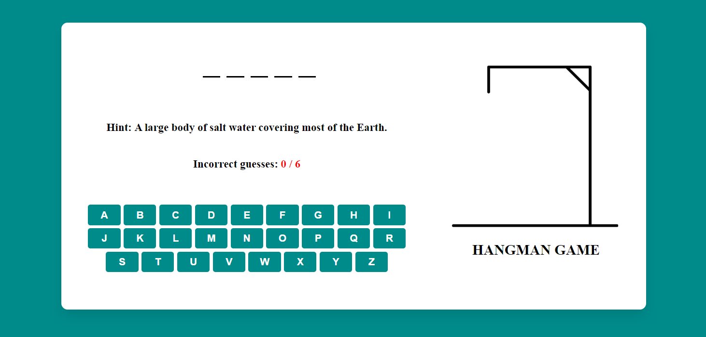

# Hangman Game

## Table of Contents

- [Introduction](#introduction)
- [Features](#features)
- [Getting Started](#getting-started)
- [Usage](#usage)
- [Game Instructions](#game-instructions)
- [Winning and Losing Scenarios](#winning-and-losing-scenarios)
- [Attributions](#attributions)
- [Technologies Used](#technologies-used)
- [Next Steps](#next-steps)

## Introduction

**Hangman Game** is a classic word-guessing game implemented using HTML, CSS, and JavaScript. This project provides an interactive and responsive user interface where players can guess letters to find the hidden word within a limited number of attempts. The game includes a dynamic word list with hints to make the game more engaging.

### Why Hangman?

Hangman is a timeless game that combines fun with learning. I chose this game for its simplicity and the opportunity to demonstrate basic web development skills in HTML, CSS, and JavaScript. This project allowed me to explore interactive UI design and responsive layouts, making it a great educational tool.

## Features

- **Interactive User Interface**: A user-friendly and engaging interface.
- **Responsive Design**: Adaptable to different screen sizes, ensuring a smooth experience on both desktop and mobile devices.
- **Dynamic Word List**: A diverse list of words and hints to keep the game interesting.
- **Game Over Modal**: A modal window that appears when the game ends, showing the result and offering a restart button.
- **Virtual Keyboard**: Users can guess letters using an on-screen keyboard.

## Getting Started

### Deployed Game

You can play the Hangman game [here](https://hangman-guess.surge.sh).

### Planning Materials

You can find the planning materials for this project [here](./Pseudocode%20for%20Hangman%20Game.txt).

## Game Instructions

### How to Play:

1. **Objective**:

   - The objective of the game is to guess the hidden word by selecting letters. You need to guess the word before you run out of allowed incorrect guesses.

2. **Starting the Game**:

   - When the game loads, a random word will be selected along with a hint displayed on the screen.
   - You will see underscores representing the letters of the hidden word.

3. **Guessing Letters**:

   - Use the on-screen virtual keyboard to guess letters.
   - Click on a letter button to make a guess.
   - If the guessed letter is in the word, it will be revealed in its correct position(s).
   - If the guessed letter is not in the word, it will count as an incorrect guess, and the hangman image will update.

4. **Tracking Progress**:

   - The number of incorrect guesses is displayed, along with the maximum allowed guesses (6).
   - Correctly guessed letters will be displayed in place of the underscores.

5. **Winning the Game**:

   - To win, you must correctly guess all the letters in the word before reaching the maximum number of incorrect guesses.
   - When you win, a modal will appear with a congratulatory message and the correct word.

6. **Losing the Game**:

   - If you reach the maximum number of incorrect guesses (6) before guessing the word, you lose.
   - When you lose, a modal will appear with a message revealing the correct word.

7. **Playing Again**:
   - After winning or losing, you can click the "Play Again" button in the modal to start a new game with a different word.

---

## Winning and Losing Scenarios

**Winning the Game**:

- You successfully guess all the letters in the word within the allowed number of guesses.
- A modal appears with the message "Congrats! You found the word:" followed by the correct word.
- The modal also displays an image indicating victory and a button to play again.

**Losing the Game**:

- You reach the maximum number of incorrect guesses (6) without guessing the word.
- A modal appears with the message "Game Over! The correct word was:" followed by the correct word.
- The modal displays an image indicating defeat and a button to play again.

## Attributions

- Icons and images used in the game are sourced from [source](https://googlefonts.github.io/noto-emoji-animation/).
- Any other libraries or resources that require attribution should be listed here.

## Technologies Used

- **HTML**: For structuring the content.
- **CSS**: For styling and responsive design.
- **JavaScript**: For game logic and interactivity.

## Next Steps

- **Additional Words and Hints**: Expand the word list to include more categories and hints.
- **Audio Feedback**: Add sound effects for correct and incorrect guesses.
- **Leaderboard**: Implement a leaderboard to track high scores.
- **Multiplayer Mode**: Introduce a multiplayer mode where players can challenge each other.
